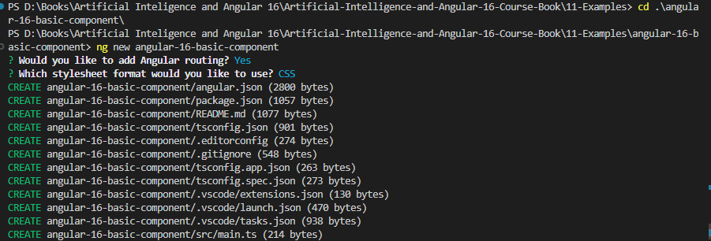
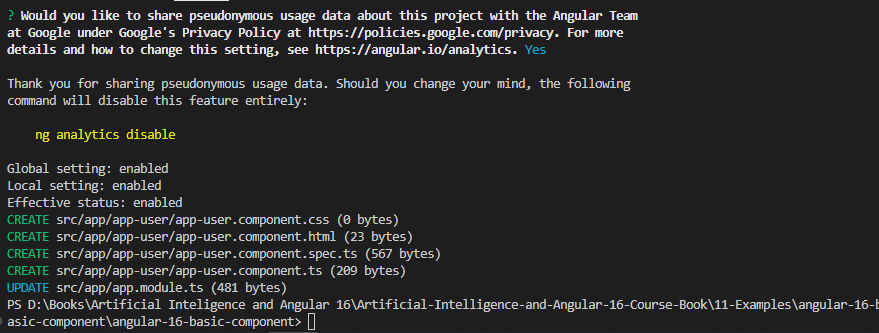

# Components, Services, and Modules

## Components

@Component({

    selector: 'app-root',
    templateUrl: './app.component.html',
    styleUrls: ['./app.component.css']
  })
  exportclassAppComponent {
    title = 'Angular 16 App';
  }

### Project Angular Folder Structure:

