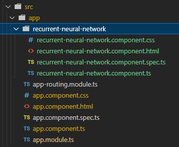
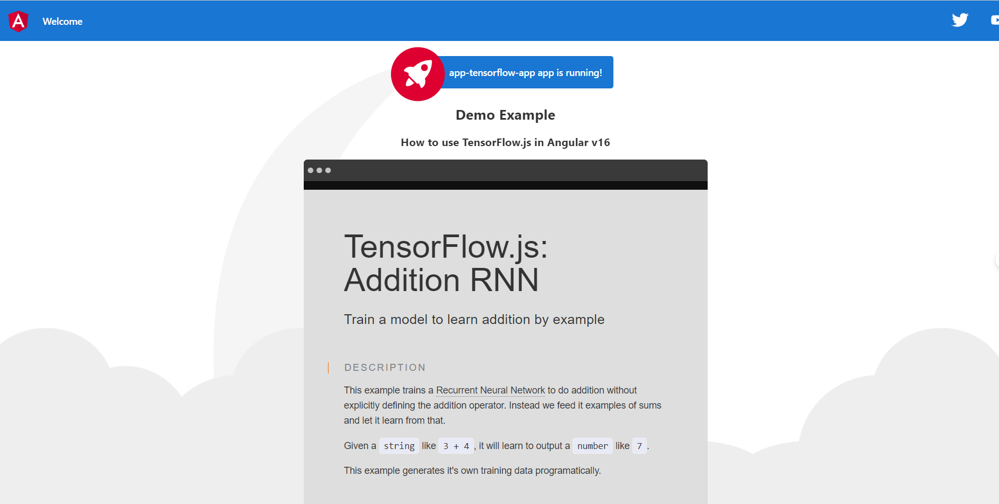

# **Mastering Artificial Intelligence and Angular 16: Course Book**

Artificial Intelligence and Angular 16 Course Book

## Introduction

Welcome to the realm of ***AI-driven development***, where technology is not just about coding and creating applications but about envisioning and building the future. The ability to integrate intelligent systems into applications, websites, and platforms has ushered in an era where software isn't just a tool but an evolving entity that learns, adapts, and grows.

The convergence of web development frameworks, like Angular, with powerful AI tools and platforms, such as OpenAI, represents a significant leap in what developers can achieve. Gone are the days when static web pages and basic CRUD applications were the norm. Now, we stand at the cusp of a new dawn, where applications understand, predict, and enhance user experiences in real-time.

***Why is this important?*** Traditional web applications can often feel static and reactive, waiting for user input to dictate behavior. With the inclusion of AI, web applications transition from being reactive to proactive. They can predict, automate, and personalize experiences in ways previously thought to be the domain of futuristic fantasies.

This guide aims to equip you with the knowledge, tools, and best practices required to harness the power of AI within modern web applications. Whether you're an AI enthusiast looking to dabble in web development or a seasoned developer eager to integrate AI into your projects, this guide has something for everyone.

Over the course of this material, we'll delve into:

1. **Foundational Concepts**: Understand the core principles of AI, its history, and its distinction from other buzzwords like machine learning and deep learning and an overview of Angular's evolution and its latest features in version 16.
2. **Development Tools & Setup**: Dive deep into setting up your development environment, from the intricacies of VSCode to initializing projects with TensorFlow.js and OpenAI.
3. **Integration**: Strategies and techniques to seamlessly integrate AI functionalities within Angular applications.
4. **Hands-on Applications**: Building AI-powered applications ranging from chatbots, image recognition systems, to advanced recommendation systems.
5. **Resources & Tools**: A dive into the most impactful platforms, tools, and resources that will aid in your development journey.
6. **Real-world Applications**: Engage in hands-on development, building AI-powered applications, and understanding how AI can be integrated into web platforms to drive user engagement and improve functionality.
7. **Ethics & Best Practices**: AI isn't just about algorithms and data; it's about responsible development. We'll touch upon the ethical considerations and best practices to ensure that your AI integrations are both effective and respectful of user rights.

The world stands on the cusp of a technological revolution. By marrying the capabilities of AI with the robustness of Angular framework, the potential to shape transformative user experiences is immense. Whether you're a seasoned developer, a beginner looking to expand your skill set, or merely an AI enthusiast, this course book is tailored to provide insights, practices, and hands-on knowledge to usher you into the future of web development. So, our future of web development is intertwined with AI. With this guide, you'll be prepared to navigate this evolving landscape, harnessing the power of AI to build the next generation of intelligent web applications. Let's embark on this enlightening journey together!

# Prerequisites

## Setting Up VSCode for Angular Development

Visual Studio Code (VSCode) is a popular code editor that offers a range of features and extensions, making it ideal for Angular development. Below are steps to set up VSCode for Angular:

### 1. Install Visual Studio Code:

If you haven't already, download and install [VSCode]([https://code.visualstudio.com/](https://code.visualstudio.com/)) ) for your platform (Windows, macOS, or Linux).

### 2. Install Node.js and npm:

Angular requires Node.js and npm (Node Package Manager) to function:

* Visit [Node.js official website]([https://nodejs.org/](https://nodejs.org/)) ) and download the LTS version.
* After installation, you can verify the installation by running the following commands in your terminal or command prompt:

| bash ``node -v`` npm-v |
| ---------------------- |

### 3. Install Angular CLI:

The Angular CLI (Command Line Interface) is a tool to initialize, develop, and maintain Angular applications:

| bash``npminstall -g @angular/cli |
| -------------------------------- |

### 4. Extensions for VSCode:

Install these essential extensions from VSCode's marketplace to enhance your Angular development experience:

- Angular Language Service: Provides a rich editing experience for Angular templates, with features like autocompletion, navigation, and error checking.


- TSLint: Integrates the TSLint static analysis tool for TypeScript. It provides linting for your TypeScript code within VSCode.
- Prettier - Code formatter: An opinionated code formatter that integrates with VSCode and supports TypeScript.


- JavaScript Debugger: Allows you to debug your JavaScript code in the browser directly from VSCode.


To install an extension:

* Open VSCode.


* Go to the Extensions view by clicking the square icon on the sidebar or press `Ctrl+Shift+X`.


* Search for the extension and click the `Install` button.

### 5. Create a New Angular Project:

With everything set up, you can now create a new Angular project directly from the terminal or command prompt:

| bash ``ngnewmy-angular-app``cd my-angular-app |
| --------------------------------------------- |

To open the project in VSCode, you can use:

| bash``code . |
| ------------ |

### 6. Running the Angular App:

Inside the project directory, run the following command to start the development server:

| bash``ng serve |
| -------------- |

Visit `http://localhost:4200/` in your browser, and you should see the default Angular welcome page.

With these tools and configurations in place, you are now set to embark on your Angular development journey in VSCode efficiently. The combination of VSCode's features with the aforementioned extensions will ensure a smooth and productive development experience.

## Setting Up TensorFlow.js in VSCode

[TensorFlow.js]([https://www.tensorflow.org/js](https://www.tensorflow.org/js)) ) is an open-source hardware-accelerated JavaScript library for training and deploying machine learning models in the browser and on Node.js. Here's how you can set up TensorFlow.js for development in Visual Studio Code (VSCode):

### 1. Install Visual Studio Code:

If you haven't already, download and install [VSCode](https://code.visualstudio.com/) for your platform (Windows, macOS, or Linux).

### 2. Install Node.js and npm:

TensorFlow.js requires Node.js and npm for development:

* Visit [Node.js official website](https://nodejs.org/) and download the LTS version.
* After installation, verify it by running the following commands in your terminal or command prompt:

| bash ``node -v`` npm-v |
| ---------------------- |

### 3. Create a New Node.js Project:

Initialize a new Node.js project by creating a new directory and initializing it:

| bash ``mkdir my-tfjs-project``cd my-tfjs-project``npminit -y |
| ------------------------------------------------------------ |

### 4. Install TensorFlow.js:

Within your project directory, install TensorFlow.js using npm:

| bash``npminstall @tensorflow/tfjs-node |
| -------------------------------------- |

For GPU support (on systems with compatible NVIDIA graphics cards and CUDA installed), use:

| bash``npminstall @tensorflow/tfjs-node-gpu |
| ------------------------------------------ |

### 5. Extensions for VSCode:

While not strictly necessary for TensorFlow.js development, these extensions can enhance the development experience:

* Prettier - Code formatter: Helps format your JavaScript/TypeScript code.

  
* Node.js Modules Intellisense: Autocompletes npm modules in import/require statements.


To install an extension:

* Open VSCode.


* Go to the Extensions view by clicking the square icon on the sidebar or press `Ctrl+Shift+X`.


* Search for the extension and click the `Install` button.

### 6. Start Coding with TensorFlow.js:

Now, you can create a new `.js` file in your project, for example, `index.js`. Open this file in VSCode and start writing your TensorFlow.js code:

| javascript ``const tf =require('@tensorflow/tfjs-node');``//Define a modelforlinear regression.``const model = tf.sequential();``model.add(tf.layers.dense({ units:1, inputShape: [1] }));``//...`` |
| --------------------------------------------------------------------------------------------------------------------------------------------------------------------------------------------------- |

### 7. Running Your TensorFlow.js Code:

You can run your TensorFlow.js code using Node.js. For the `index.js` file:

| bash``node index.js |
| ------------------- |

With the above steps, you have successfully set up TensorFlow.js for development in VSCode. As you delve deeper into TensorFlow.js, you'll find its integration with modern JavaScript and Node.js features to be a powerful combination for machine learning development in this book we will explore that with the Angular and TensorFlow.js following reading the sections and embrace us in your journey exploring TensorFlow.js.

## Setting Up OpenAI in VSCode

[OpenAI](https://www.openai.com/) provides APIs that developers can use to integrate AI models, like ChatGPT, into applications. Setting up OpenAI with Visual Studio Code (VSCode) involves preparing your development environment for Node.js and then integrating OpenAI's SDK. Here's a step-by-step guide:

### 1. Install Visual Studio Code:

If you haven't already, download and install [VSCode](https://code.visualstudio.com/) for your platform (Windows, macOS, or Linux).

### 2. Install Node.js and npm:

To interact with OpenAI's API using JavaScript/TypeScript, you'll need Node.js and npm:

* Visit the [Node.js official website](https://nodejs.org/) and download the LTS version.
* After installation, verify by running these commands in your terminal or command prompt:

| bash ``node -v`` npm-v |
| ---------------------- |

### 3. Create a New Node.js Project:

Initialize a new Node.js project:

| bash ``mkdir my-openai-project``cd my-openai-project``npminit -y |
| ---------------------------------------------------------------- |

### 4. Install the OpenAI Node.js SDK:

Within your project directory, install the OpenAI SDK:

| bash``npminstall openai |
| ----------------------- |

### 5. Extensions for VSCode:

Some useful extensions for this development include:

* Prettier - Code formatter: Helps format your JavaScript/TypeScript code.

  
* DotENV: Provides support for `.env` files which you might use to store your OpenAI API key.


To install an extension:

* Open VSCode.


* Go to the Extensions view by clicking the square icon on the sidebar or press `Ctrl+Shift+X`.


* Search for the extension and click the `Install` button.

### 6. Start Coding with OpenAI SDK:

Create a new `.js` file in your project, such as `index.js`. Open this file in VSCode and start integrating the OpenAI SDK. For security reasons, store your OpenAI API key in a `.env` file:

| plaintext``OPENAI_API_KEY=YOUR_API_KEY_HERE |
| ------------------------------------------- |

And then in `index.js`:

| javascript ``require('dotenv').config();``const { OpenAIApi } =require('openai');``const openai =newOpenAIApi({``key: process.env.OPENAI_API_KEY ``});``async function queryGPT3(promptText) {``const response =awaitopenai.complete({``model:"text-davinci-002",``prompt: promptText,``maxTokens:150 ``});`` returnresponse.data.choices[0].text.trim();``}``//Test the function``queryGPT3("Translate the following English text to French: 'Hello World'").then(console.log); |
| -------------------------------------------------------------------------------------------------------------------------------------------------------------------------------------------------------------------------------------------------------------------------------------------------------------------------------------------------------------------------------------------------------------------------------------------------------------------------------- |

### 7. Running Your Code:

You can run your code using Node.js:

| bash``node index.js |
| ------------------- |

Now you've successfully set up OpenAI for development in VSCode. Remember to keep your API key secure and avoid hardcoding it directly into your scripts. Using environment variables, as shown above, is a safer practice.

# **4.2 How to use TensorFlow.js in Angular v16**

### New Component

```
bash
ng generate component app-user
```





app-tensorflow-app
├───.vscode
├───src
│   ├───app
│   │   └───recurrent-neural-network
│   └───assets
├───node_modules
